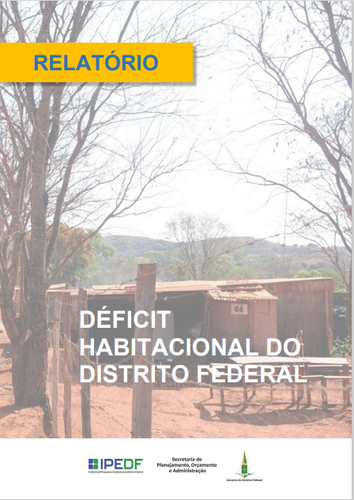
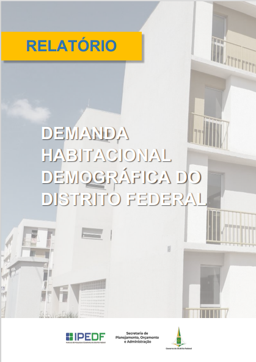

# Déficit habitacional e Demanda Habitacional demográfica do Distrito Federal | 2021

 
 

Este é um projeto para disponibilização pública dos códigos utilizados para o cálculo do Déficit e Demanda Habitacional no DF conforme dados da Pesquisa Distrital por Amostra de Domicílios (PDAD) 2021.

# Justificativa da pesquisa

A política habitacional do DF tem por objetivo a solução das questões de habitabilidade para todos os segmentos sociais, com prioridade para a população de média e baixa renda.

Uma das formas de garantir moradia digna à população é elaborar políticas baseadas em indicadores para apoiar as discussões das políticas habitacionais e orientar ações públicas, tais como o Déficit Habitacional, que aponta as deficiências do estoque de moradia, e a Demanda Habitacional Demográfica, que avalia a demanda potencial por novos domicílios da população na faixa de 24 a 64 anos, apta à formação de um novo arranjo domiciliar.

Com os dados da Pesquisa Distrital por Amostra de Domicílios (PDAD 2021), ambos indicadores foram calculados pelo Instituto de Pesquisa e Estatística do DF - IPEDF Codeplan, com o objetivo de contribuir no desenho da política habitacional do DF.

# Ajuste de dados sobre déficit habitacional na base original da PDAD 2021

Para caracterização do subcomponente "Domicílios Improvisados", foi realizada verificação detalhada dos domicílios da amostra da PDAD 2021, apoiada por análises geoespaciais e visuais por meio do *Google Street View*, resultando na variável `B01_déficit` (disponível em: [https://www.ipe.df.gov.br/deficit-e-demanda-habitacional-do-distrito-federal-2021/](https://www.ipe.df.gov.br/deficit-e-demanda-habitacional-do-distrito-federal-2021/)).

Para a caracterização dos domicílios rústicos, baseada no cruzamento das respostas "alvenaria sem revestimento" (variável B07=2) aliada à presença apenas de "contrapiso" (variável B08=1) ou "cimento alisado" (variável B08=2) e "cobertura em telha de fibrocimento sem laje" (variável B09=4). Também foi realizada verificação detalhada dos domicílios da amostra da PDAD 2021, apoiada por análises geoespaciais e visuais por meio do *Google Street View*, resultando na variável `B07_atualizada` (disponível em: [https://www.ipe.df.gov.br/deficit-e-demanda-habitacional-do-distrito-federal-2021/](https://www.ipe.df.gov.br/deficit-e-demanda-habitacional-do-distrito-federal-2021/)).

# Orientações e usos

Neste projeto, estão disponibilizados os códigos - em linguagem `R` - utilizados para o cálculo do Déficit e Demanda Habitacional do DF, conforme dados da PDAD 2021.

Neles, já estão organizados o acesso aos microdados da PDAD 2021 - disponibilizados pelo IPEDF-Codeplan - e a construção dos indicadores. Pequenos ajustes podem ser necessários para a utilização dos códigos, conforme a necessidade do usuário e o sistema operacional utilizado.

Os códigos permitem a reprodução dos principais resultados apresentados nos relatórios da pesquisa disponibilizados na página oficial do Instituto, disponível [`aqui`](https://www.ipe.df.gov.br/deficit-e-demanda-habitacional-do-distrito-federal-2021/). No arquivo `renv.lock`, está a lista dos pacotes utilizados, visando garantir a estabilidade de reprodução dos códigos.

# Créditos 

A pesquisa sobre Déficit e Demanda Habitacional do Distrito Federal | 2021 foi realizada pela equipe da Diretoria de Estudos e Políticas Ambientais e Territoriais (DEPAT), vinculada ao IPEDF.

A principal fonte de dados foi a Pesquisa Distrital por Amostra de Domicílios (PDAD - 2021), é uma pesquisa domiciliar realizada pelo Instituto de Pesquisa e Estatística do Distrito Federal (IPEDF).

*Fonte para citação*: IPEDF Codeplan, Instituto de Pesquisa e Estatística do Distrito Federal. Déficit Habitacional do Distrito Federal 2021. Brasília, 2023.

Os usos dos dados são livres, desde que citada a fonte.
